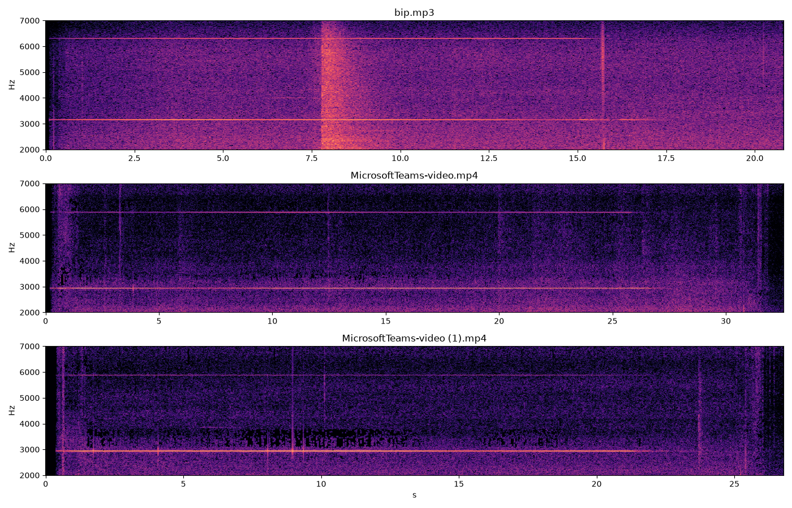
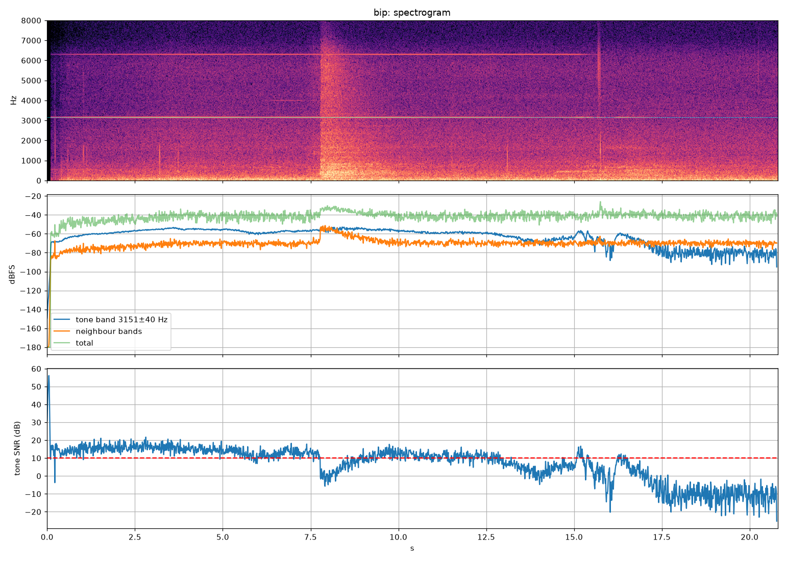

# Bip characterisation (audio analysis)

This folder holds the Python analysis behind the parameters used by the web app.

Characterisation of the "horrible bip" heard in three recordings, and a prototype detector
(the future "sensor" logic). Analysis date: 2026-09-03.

| File | Duration | Audio | Bip present |
|---|---|---|---|
| `bip.mp3` | 20.8 s | MP3 320 kb/s, 48 kHz stereo | 0 s to ~17.3 s, then gone |
| `MicrosoftTeams-video.mp4` | 32.5 s | AAC 44.1 kHz stereo | 0.2 s to ~27.3 s, then gone |
| `MicrosoftTeams-video (1).mp4` | 26.8 s | AAC 44.1 kHz stereo | 0.5 s to ~22.5 s, then gone |

The bip is the same kind of sound in all three files, and in each file it stops before the end,
which gives a clean "with bip" / "without bip" reference.

## 1. What the bip is

**A single, continuous, extremely pure sine tone around 3 kHz.** It is not a repeating beep:
it is on permanently until it fades out. In a spectrogram it appears as one razor-thin horizontal line
plus a weaker line at exactly twice the frequency (2nd harmonic).



### Measured parameters

| Parameter | `bip.mp3` | `MicrosoftTeams-video.mp4` | `MicrosoftTeams-video (1).mp4` |
|---|---|---|---|
| Fundamental frequency f0 | **3151.2 Hz** | **2942.1 Hz** | **2941.5 Hz** |
| Frequency stability | < 0.5 Hz drift over 7 s (measurement-limited) | < 0.5 Hz over 10 s | < 0.5 Hz over 10 s |
| -3 dB line width | < 0.4 Hz (window-limited, i.e. a perfect sine) | < 0.3 Hz | < 0.3 Hz |
| 2nd harmonic (2·f0) | 6302 Hz, -13 dB rel. f0 | 5884 Hz, -24 dB | 5883 Hz, -25 dB |
| 3rd harmonic and above | < -50 dB (negligible) | < -50 dB | < -55 dB |
| Sidebands within ±400 Hz | none above -35 dB | none | none |
| Level of the tone while on | -51 to -57 dBFS (median -56) | -52 to -58 dBFS (median -56) | -48 to -56 dBFS (median -52) |
| Prominence over neighbouring bins (±60..240 Hz) | 30-37 dB in silence, still ≥ 22 dB during speech | 33-43 dB | 38-52 dB |
| Amplitude modulation | none periodic; only slow wander of a few dB (seconds) | none | none |
| Temporal structure | continuous (no on/off pattern) | continuous | continuous |
| Fade-out | drops in stages from 12.5 s, final decay 16.2 s → 17.3 s (~1 s) | decay 26.4 s → 27.3 s (~1 s) | decay 21.2 s → 22.0 s, residual until 22.5 s |
| After fade-out, level in the f0 bin | -85 dBFS median (≈ 30 dB below the tone) | -93 dBFS | -93 dBFS |

Notes:

- **Two frequencies were observed: 3151 Hz (MP3) and 2942 Hz (both videos), ratio 1.071.**
  The MP3 and the videos were captured with two different recording devices, but that alone cannot
  explain it: see section 1.1 below.
- The 2nd harmonic is stronger in the MP3 (-13 dB) than in the videos (-24 dB). This depends on the
  microphone/codec chain, so it is a useful confirmation feature but not a reliable primary criterion.
- The bip does not stop abruptly: it decays over roughly one second, like a resonator being
  switched off or an oscillator losing power. In `bip.mp3` there is also a broadband click at 15.7 s
  (someone handling something) right before the final decay.
- The tone is ~15-20 dB below the overall signal level (speech, room noise) yet stays 30+ dB above
  the spectral floor in its own bin because all its energy sits in a single FFT bin. **This is why it is
  so audible and so easy to detect with a narrow-band method, and nearly invisible to a simple
  loudness meter.**

### 1.1 Why two different frequencies?

The MP3 was recorded with one device and the two videos with another. **A recording device does
not change the pitch of what it records.** Its sample clock is a crystal accurate to roughly 0.01 %
(100 ppm); a 7.1 % error is a thousand times larger than any real clock drift. So the device
difference is not, by itself, the explanation. Checks made:

| Test | Result | Meaning |
|---|---|---|
| Harmonic at exactly 2·f0 in every file | yes (6302 = 2×3151, 5884 = 2×2942) | both are real tones, not analysis artefacts |
| Videos vs. each other (same device, two moments) | 2942.1 Hz and 2941.5 Hz | the source is stable to 0.02 % within one device |
| Known resample ratios (48000/44100 = 1.088, …) | no standard ratio equals 1.071 | a wrong sample-rate header is unlikely |
| Mains-hum lines at 50/100 Hz vs 53.6/107 Hz | no usable hum in any file | inconclusive |
| Envelope alignment MP3 ↔ videos (native and stretched by 1.071) | MP3 has a +17 dB speech burst at 7.5-9 s that no video has | the three files are three separate moments, so a speed change cannot be proven or excluded by alignment |
| MP3 metadata / spectrum | no tags; flat floor with a sharp 20 kHz cut-off (standard MP3 low-pass) | no evidence of editing, but a speed change before encoding would leave no trace here |

Two hypotheses remain:

1. **The bip source itself was at a different frequency on the day of the MP3** (different unit,
   temperature, supply voltage, or a different state of the machine). Most likely, given how stable
   the videos are between themselves.
2. The MP3 export applied a speed/pitch change of 7 % (some phone apps or editors do this silently).
   Cannot be excluded without the original recording.

How to settle it: record the bip once more with **both devices at the same time**. If both files
then show the same frequency, hypothesis 1 is confirmed and the detector may need the wide band
permanently. If they still differ by 7 %, the MP3 chain is altering pitch and the detector can use
a narrow band around 2942 Hz.

**Consequence for the sensor:** until this is known, search the whole 2.5-3.5 kHz band and rely on
the "narrow, stable peak" signature rather than on one fixed frequency.

Detailed per-file plots (spectrogram, tone-band level vs. neighbours, tone SNR over time):
`bip_profile.png`, `video1_profile.png`, `video2_profile.png`.



## 2. Signature for a sensor

Summary of what a detector must look for:

1. A **spectral peak in 2.5-3.5 kHz** that stands **≥ 15 dB above the median of that band**
   (observed: 22-52 dB, so 15 dB gives a comfortable margin).
2. The peak **frequency does not move** (observed < 1 Hz; allow ±15 Hz with 100 ms frames).
   Speech and music harmonics sweep, the bip does not. This is the strongest discriminant.
3. The peak is **present continuously** for at least 0.3 s. Nothing else in these recordings holds a
   fixed narrow line for that long.
4. Optional confirmation: a second, weaker peak at **2·f0** (≥ 10 dB above its neighbourhood).
5. A 16 kHz sample rate is sufficient (Nyquist 8 kHz covers f0 and 2·f0). Frames of 100 ms give a
   10 Hz bin width, which is fine.

Expected absolute level at the microphone position: ~-50 to -57 dBFS in these recordings, but
this depends entirely on gain and distance, so the prominence criterion (relative) is preferred over
an absolute threshold. An absolute floor of about -80 dBFS avoids triggering on pure noise.

## 3. Prototype detector

`detect_bip.py` implements the signature above (FFT peak search, prominence, frequency-stability
window, ON/OFF hysteresis). It reads any format ffmpeg can decode.

```bash
uv sync --project analysis
uv run --project analysis python analysis/detect_bip.py bip.mp3 "MicrosoftTeams-video.mp4" "MicrosoftTeams-video (1).mp4"
```

Result on the three files (one event each, no false trigger during speech or after the fade-out):

```
bip.mp3: 20.8 s
  BIP    0.05s ->  17.10s  (17.05s)  f = 3150 Hz  level = -53 dBFS  prominence = 28 dB
MicrosoftTeams-video.mp4: 32.5 s
  BIP    0.20s ->  27.10s  (26.90s)  f = 2940 Hz  level = -52 dBFS  prominence = 37 dB
MicrosoftTeams-video (1).mp4: 26.8 s
  BIP    0.55s ->  23.55s  (23.00s)  f = 2940 Hz  level = -49 dBFS  prominence = 41 dB
```

Parameters are at the top of the script:

| Parameter | Value | Meaning |
|---|---|---|
| `SR` | 16000 Hz | working sample rate |
| `FRAME` / `HOP` | 100 ms / 50 ms | analysis frame and hop |
| `BAND` | 2500-3500 Hz | search band |
| `PROM_DB` | 15 dB | peak vs. band median |
| `MIN_LEVEL_DBFS` | -80 dBFS | absolute floor |
| `FREQ_TOL` / `STABLE_FRAMES` | 15 Hz / 10 frames (0.5 s) | frequency-stability test |
| `ON_FRAMES` / `OFF_FRAMES` | 6 (0.3 s) / 20 (1.0 s) | hysteresis |

The same logic ports directly to an embedded target: a Goertzel filter bank (or a 1024-point FFT
at 16 kHz) on a microcontroller is enough. If the source frequency turns out to be fixed per device,
a single Goertzel at f0 plus two reference Goertzels at f0 ± 150 Hz is the cheapest implementation.

## 4. Reproducing the analysis

```bash
uv sync --project analysis

ffmpeg -i bip.mp3 -ac 1 -ar 48000 analysis/bip_mono.wav
ffmpeg -i MicrosoftTeams-video.mp4 -vn -ac 1 -ar 48000 analysis/video1_mono.wav
ffmpeg -i "MicrosoftTeams-video (1).mp4" -vn -ac 1 -ar 48000 analysis/video2_mono.wav
uv run --project analysis python analysis/profile.py analysis/bip_mono.wav          # dominant peak every 100 ms
uv run --project analysis python analysis/characterise.py analysis/bip_mono.wav bip # f0, harmonics, timing, plots
uv run --project analysis python analysis/refine.py                                  # narrow-band tracking, sidebands, AM depth
uv run --project analysis python analysis/ending.py                                  # fade-out detail
uv run --project analysis python analysis/compare_fig.py                             # comparison spectrogram
uv run --project analysis python analysis/hum_check2.py                              # hum lines, native vs shifted
uv run --project analysis python analysis/sync_check2.py                             # envelope alignment MP3 vs videos
uv run --project analysis python analysis/cutoff.py                                  # high-frequency cut-offs
```

Run everything from the repository root. The three source recordings are not committed (private); put them in the repository root to reproduce.
